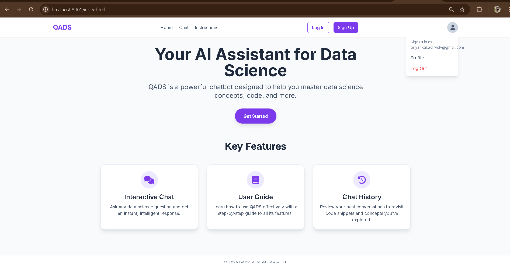
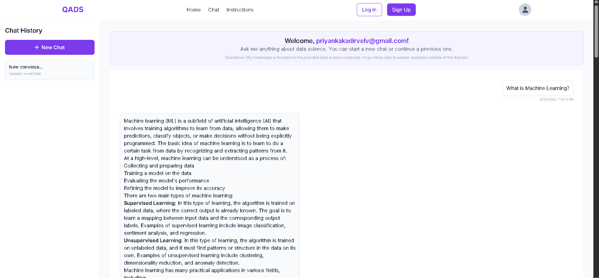
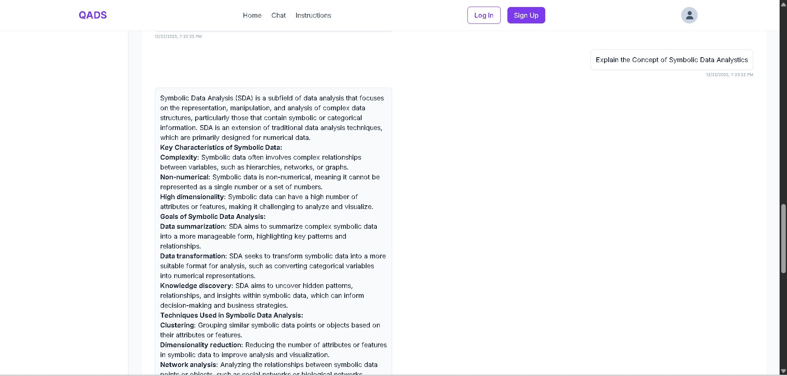
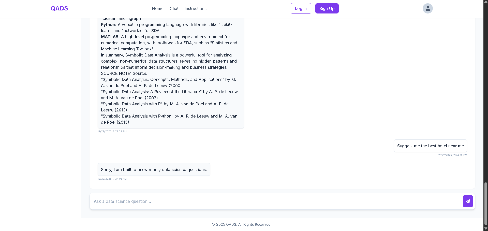
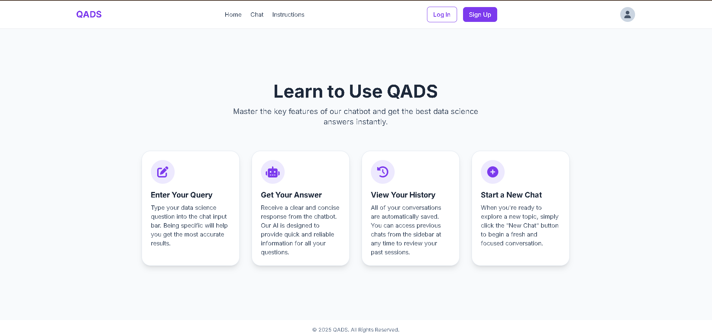

# 🎓 QADS - Question Answering Data Science Assistant


## 📋 Table of Contents

- [Project Overview](#project-overview)
- [Problem Statement](#problem-statement)
- [Solution Architecture](#solution-architecture)
- [Technology Stack](#technology-stack)
- [Project Structure](#project-structure)
- [System Architecture](#system-architecture)
- [Installation & Setup](#installation--setup)
- [API Documentation](#api-documentation)
- [Features](#features)
- [Testing Strategy](#testing-strategy)
- [Current Limitations](#current-limitations)
- [Future Enhancements](#future-enhancements)
- [Contributing](#contributing)
- [License](#license)

---

## 📸 Screenshots

### Home Page

*The landing page featuring key features and easy navigation.*

### Chat Interface

*The main chat interface where users can ask questions and receive grounded answers.*



*Detailed explanation of complex concepts like Symbolic Data Analysis.*

### Error Handling

*Robust error handling ensures users are informed about out of domain questions*

### User Guide

*Comprehensive user guide to help users get the most out of QADS.*

---

## 🚀 Project Overview

**QADS** is an intelligent, production-ready **Retrieval-Augmented Generation (RAG)** chatbot designed specifically for Data Science students and professionals. It combines domain-specific knowledge retrieval with intelligent web search fallback to provide accurate, context-grounded answers to data science, machine learning, statistics, and engineering questions.

### Why QADS?

Traditional chatbots suffer from:
- **Hallucinations**: Generating confident but false information
- **Lack of Domain Grounding**: No connection to authoritative data science sources
- **Outdated Information**: Training data becomes stale over time

QADS addresses these through **Retrieval-Augmented Generation**, which grounds responses in:
1. A curated knowledge base of 50+ data science textbooks and research papers
2. Real-time web search when knowledge base coverage is insufficient
3. Semantic search using embeddings for precise context retrieval

---

## 🎯 Problem Statement

### Challenges Faced by Data Science Students

1. **Scattered Learning Resources**: Knowledge fragmented across multiple textbooks, online courses, and documentation
2. **Hallucinations in Generic Chatbots**: ChatGPT and similar models provide plausible-sounding but inaccurate answers
3. **Lack of Code Examples**: Need for practical, runnable code solutions
4. **Domain Expertise Gap**: Difficulty distinguishing authoritative sources from unreliable information
5. **Time Inefficiency**: Hours spent searching instead of learning

### QADS Objectives

✅ Provide **domain-specific, fact-checked** answers grounded in authoritative sources
✅ Deliver **code solutions** with detailed explanations (Python, SQL, R)
✅ Enable **seamless learning continuity** with chat history and threads
✅ Ensure **scalability** with modular backend architecture
✅ Maintain **user privacy** with local history storage and authentication

---

## 🏗️ Solution Architecture

### System Flow Diagram

```
┌─────────────────────────────────────────────────────────────────┐
│                     USER INTERFACE (Frontend)                    │
│              HTML/CSS/Vanilla JS - Authentication                │
│              Chat Interface - Responsive Design                  │
└────────────────────┬────────────────────────────────────────────┘
                     │
                     ▼
        ┌────────────────────────────┐
        │   FastAPI Backend Server   │
        │   (Port 8000)              │
        └────────────────────────────┘
                     │
          ┌──────────┼──────────┐
          ▼          ▼          ▼
    ┌─────────┐ ┌──────────┐ ┌──────────────┐
    │ Auth    │ │ History  │ │ Query        │
    │ Manager │ │ Manager  │ │ Processor    │
    └─────────┘ └──────────┘ └──────────────┘
                     │
          ┌──────────┴──────────┐
          ▼                     ▼
    ┌──────────────┐    ┌──────────────────┐
    │ Embedding    │    │ Vector Retrieval │
    │ Generator    │    │ (Pinecone)       │
    │ (Cohere)     │    └──────────────────┘
    └──────────────┘             │
          │                      ▼
          │              ┌──────────────────┐
          │              │ Context Builder  │
          │              │ (Augmentation)   │
          │              └──────────────────┘
          │                     │
          └─────────┬───────────┘
                    ▼
          ┌──────────────────────┐
          │  LLM Response Engine  │
          │  (Groq API)          │
          └─────────┬────────────┘
                    │
        ┌───────────┴────────────┐
        ▼                        ▼
   ┌─────────────┐       ┌──────────────────┐
   │ Response    │       │ Web Search       │
   │ with Context│       │ Fallback         │
   │ (Success)   │       │ (Insufficient    │
   └─────────────┘       │  Knowledge Base) │
                         └──────────────────┘
```

### RAG Pipeline Stages

| Stage | Component | Purpose |
|-------|-----------|---------|
| **Input** | Query Processor | Validate and filter user queries |
| **Embedding** | Cohere API | Convert query to vector representation |
| **Retrieval** | Pinecone Vector DB | Semantic search over knowledge base |
| **Augmentation** | Context Builder | Format retrieved documents as context |
| **Generation** | Groq LLM | Generate response using context |
| **Fallback** | SerpAPI Web Search | Search web if knowledge base insufficient |
| **Output** | Response Handler | Format and deliver response to frontend |

---

## 💻 Technology Stack

### Backend Stack

| Layer | Technology | Purpose |
|-------|-----------|---------|
| **API Framework** | [FastAPI](https://fastapi.tiangolo.com/) | High-performance async REST API |
| **Web Server** | [Uvicorn](https://www.uvicorn.org/) | ASGI server for production deployment |
| **PDF Processing** | PyPDF, PyMuPDF | Extract text from PDF documents |
| **Text Chunking** | LangChain | Split documents into semantic chunks |
| **Embeddings** | [Cohere API](https://cohere.com/) | Generate vector embeddings |
| **Vector Database** | [Pinecone](https://www.pinecone.io/) | Semantic search and retrieval |
| **LLM** | [Groq API](https://groq.com/) | Ultra-fast inference engine |
| **Web Search** | [SerpAPI](https://serpapi.com/) | Google search integration |
| **Configuration** | python-dotenv | Secure environment variable management |
| **Authentication** | passlib + bcrypt | Secure password hashing |

### Frontend Stack

| Layer | Technology | Purpose |
|-------|-----------|---------|
| **Markup** | HTML5 | Semantic structure |
| **Styling** | Tailwind CSS + Custom CSS | Responsive, modern UI design |
| **Scripting** | Vanilla JavaScript (ES6+) | DOM manipulation and API calls |
| **Icons** | Font Awesome 6.4 | Professional icon set |
| **Fonts** | Google Fonts (Inter) | Modern typography |

### Development & Deployment

| Tool | Purpose |
|------|---------|
| Python 3.9+ | Primary development language |
| Git | Version control |
| Environment Files | Configuration management (.env) |

---

## 📁 Project Structure

```
QADS_Chatbot/
│
├── backend/                          # FastAPI backend server
│   ├── config/
│   │   ├── __init__.py
│   │   └── config.py                # API keys, paths, environment config
│   │
│   ├── models/
│   │   ├── __init__.py
│   │   ├── embeddings.py            # Cohere embeddings & Pinecone integration
│   │   └── llm.py                   # Groq LLM client & response generation
│   │
│   ├── utils/
│   │   ├── __init__.py
│   │   ├── pdf_processor.py         # PDF loading, parsing, chunking
│   │   ├── web_search.py            # SerpAPI web search integration
│   │   └── scraper.py               # Web scraping utilities
│   │
│   ├── data/
│   │   ├── users.json               # User credentials (local storage)
│   │   ├── ingested_files.json      # Track processed PDFs
│   │   └── history/                 # User conversation threads
│   │
│   ├── books_pdfs/                  # Knowledge base (50+ textbooks)
│   │   └── [PDF files]
│   │
│   ├── main.py                      # FastAPI application entry point
│   ├── requirements.txt              # Python dependencies
│   └── .env                          # Environment variables (API keys)
│
├── frontend/                         # Web UI
│   ├── css/
│   │   └── style.css                # Custom CSS styles
│   │
│   ├── js/
│   │   ├── app.js                   # Main application logic
│   │   ├── auth.js                  # Authentication functions
│   │   ├── api.js                   # API client
│   │   └── utils.js                 # Helper utilities
│   │
│   ├── index.html                   # Home page
│   ├── chat.html                    # Chat interface
│   ├── login.html                   # Authentication page
│   ├── instruction.html             # User guide
│   └── favicon.svg                  # App icon
│
├── README.md                        # This file
├── Qads_Running_Steps.txt          # Quick start guide
├── allfiles.txt                     # File manifest
├── .gitattributes                   # Git configuration

```

---

## 🔧 System Architecture

### Backend Architecture: RAG Pipeline

#### 1. **Configuration Layer** (`config/config.py`)

Centralized management of:
- API keys (Cohere, Groq, Pinecone, SerpAPI)
- File paths (PDF folder, data storage)
- Application settings (Pinecone index name, etc.)
- Environment variable loading via `python-dotenv`

#### 2. **PDF Ingestion Layer** (`utils/pdf_processor.py`)

**Process**:
1. Scan `books_pdfs/` directory for all PDF files
2. Extract text using PyPDF and PyMuPDF
3. Split documents into semantic chunks (overlap-aware)
4. Log ingested files to prevent re-processing

**Key Features**:
- Lazy loading with ingestion caching
- Handles corrupted PDFs gracefully
- Configurable chunk sizes and overlap
- Supports 50+ textbooks simultaneously

#### 3. **Embedding & Vector Storage** (`models/embeddings.py`)

**Cohere Embeddings**:
- Converts text chunks to 4096-dimensional vectors
- Captures semantic meaning for similarity search
- Suitable for specialized domain knowledge

**Pinecone Vector Database**:
- Stores embeddings with metadata (source, page number)
- Enables fast similarity search (milliseconds)
- Auto-scaling for growing knowledge base
- Index name: `"qads"`

#### 4. **Query Processing & Retrieval** (`models/embeddings.py::retrieve_context`)

**Flow**:
1. User query → Cohere embedding
2. Semantic search in Pinecone (top-k retrieval)
3. Extract relevant chunks with metadata
4. Rank and filter by relevance score
5. Format context for LLM

**Features**:
- Configurable top-k retrieval
- Relevance filtering
- Metadata preservation (source document, page)

#### 5. **LLM Response Generation** (`models/llm.py`)

**Domain Validation**:
- Pre-filter: Check if query is data science-related
- 50+ keywords covering DS, ML, stats, visualization, etc.
- Reject off-topic queries before LLM call

**Response Generation** (via Groq API):
- Takes augmented context + chat history
- Generates detailed, grounded responses
- Supports multiple response styles (Detailed, Concise, Code-Focused)
- Streaming for real-time user feedback

**Fallback Strategy**:
- If context retrieval insufficient → SerpAPI web search
- Integrates web search results into prompt
- Ensures coverage for emerging topics

#### 6. **User Authentication & History** (`main.py`)

**Authentication**:
- Username/password with bcrypt hashing
- JWT-like session management
- Persistent user data in `data/users.json`

**Conversation Management**:
- Per-user conversation threads
- Thread-based history storage
- Legacy history migration support
- Export conversation history

### Frontend Architecture

#### 1. **Authentication Layer** (`login.html` + `js/auth.js`)

**Features**:
- Sign-up with validation
- Secure login with bcrypt verification
- Session persistence (localStorage)
- Logout functionality
- User avatar display

#### 2. **Chat Interface** (`chat.html` + `js/app.js`)

**Components**:
- **Message Display**: Scrollable chat history with syntax highlighting
- **Input Area**: Auto-expanding textarea with send button
- **Thread Navigation**: Switch between conversation threads
- **Loading States**: Visual feedback during API calls
- **Code Highlighting**: Pretty-print code blocks (Python, SQL, R)

**Features**:
- Real-time message streaming
- Error handling with user-friendly messages
- Responsive design (mobile-first)
- Dark/light theme support (via Tailwind)

#### 3. **Instructions Page** (`instruction.html`)

**Content**:
- Getting started guide
- Feature explanation
- Example queries
- Best practices for optimal responses

#### 4. **Navigation** (`index.html`)

**Landing Page**:
- Feature showcase
- Call-to-action for authentication
- Links to chat and instructions
- Professional branding

### API Endpoints

#### Authentication

```
POST /register
- Input: { "username": str, "password": str }
- Output: { "message": str, "user_id": str }

POST /login
- Input: { "username": str, "password": str }
- Output: { "message": str, "token": str }

POST /logout
- Input: { "username": str }
- Output: { "message": str }
```

#### Chat & Query

```
POST /query
- Input: { 
    "username": str, 
    "message": str, 
    "thread_id": str (optional)
  }
- Output: { 
    "response": str, 
    "sources": [{ "document": str, "page": int }],
    "thread_id": str 
  }
```

#### History Management

```
GET /history/{username}
- Output: { "threads": [{ "id": str, "messages": [...] }] }

GET /history/{username}/{thread_id}
- Output: { "messages": [...] }

DELETE /history/{username}/{thread_id}
- Output: { "message": str }
```

---

## 📦 Installation & Setup

### Prerequisites

- **Python 3.9+**
- **API Keys**: Cohere, Groq, Pinecone, SerpAPI


### Integration Testing

**Scenarios**:
1. **End-to-End Query Flow**: Query → Embedding → Retrieval → Generation
2. **Web Search Fallback**: Verify fallback triggers on insufficient knowledge base
3. **Authentication Flow**: Registration → Login → Protected endpoints
4. **History Management**: Create, update, delete conversation threads

### Acceptance Testing

**User Scenarios**:
1. User can register and login
2. User can ask data science questions and receive grounded answers
3. Response includes source documents
4. Chat history persists across sessions
5. Web search provides coverage for emerging topics


---

## ✨ Features

### Core Features

- ✅ **Domain-Specific QA**: Trained on 50+ data science textbooks
- ✅ **RAG Architecture**: Grounded in authoritative sources, no hallucinations
- ✅ **Code Solutions**: Python, SQL, R code with explanations
- ✅ **Web Search Fallback**: Google search via SerpAPI for emerging topics
- ✅ **Robust Authentication**: Secure registration and login with session persistence and error handling
- ✅ **Conversation Threads**: Organize chats by topic with rename/delete capabilities
- ✅ **Chat History**: Persistent conversation storage with local caching for speed
- ✅ **Responsive Design**: Mobile-friendly frontend with Tailwind CSS
- ✅ **Source Attribution**: View source documents for answers
- ✅ **Production-Ready API**: FastAPI with async/await and comprehensive error logging

### Advanced Features

- **Semantic Search**: Vector-based similarity search
- **Dynamic Chunking**: Context-aware document segmentation
- **Response Styling**: Configurable detail levels (Detailed, Concise, Code-Focused)
- **Error Handling**: Graceful fallbacks and user-friendly messages
- **Scalability**: Modular backend supports horizontal scaling

---

## 🔒 Security Considerations

### Implemented

- ✅ Password hashing with bcrypt
- ✅ CORS enabled for frontend-backend communication
- ✅ Environment variable protection (.env files)
- ✅ Input validation (query, username, password)
- ✅ Local data storage (no cloud persistence of chat history by default)


## 🎯 Vision

**QADS aims to democratize data science education** by providing instant, accurate, context-grounded answers to students worldwide. By combining the power of retrieval-augmented generation with domain expertise, we eliminate hallucinations and ensure every answer is backed by authoritative sources.

The future of learning is **AI-assisted, source-aware, and scalable**.

